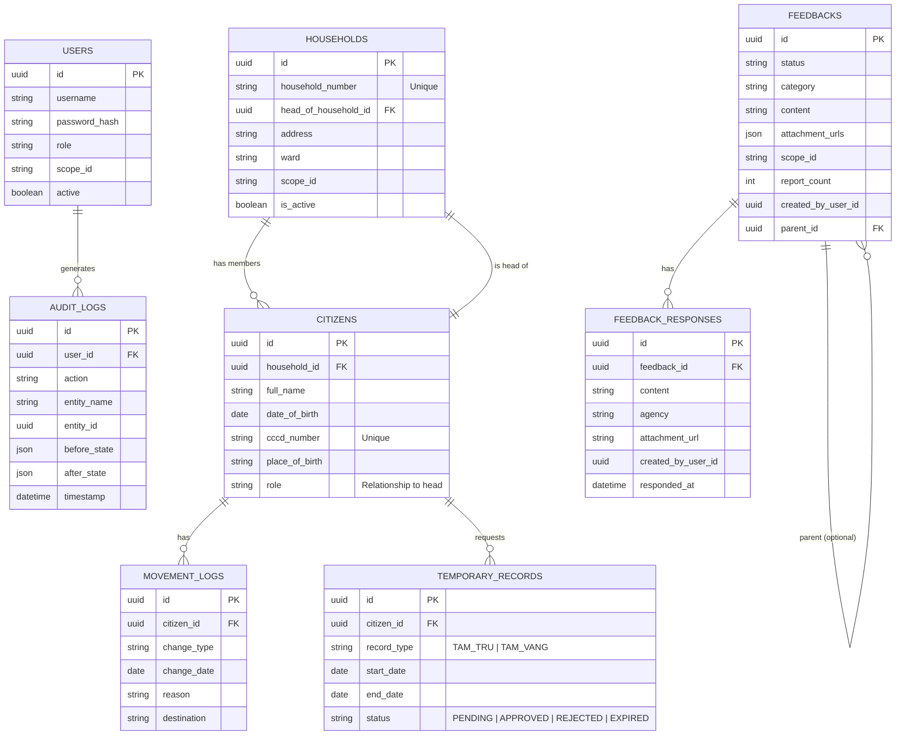

# Database Schema Analysis

This document outlines the database structure for the project, analyzing the `authentication`, `residents`, and `feedback` services.

## Overview

The system is composed of three main microservices, each with its own logical schema (though they might share a physical database instance in the current setup).

-   **Authentication**: Manages users and audit logs.
-   **Residents**: Manages households, citizens, movement logs, and temporary residence/absence records.
-   **Feedback**: Manages feedback submissions and responses.

## Entity-Relationship Diagram

## Table Details

### Authentication Service

#### `users`
- Stores system users (admin, etc.).
- `scope_id` is used potentially for multi-tenancy or permission scoping.

#### `audit_logs`
- Tracks actions performed by users.

### Residents Service

#### `households`
- Represents a household unit.
- **Circular Dependency**: Contains `head_of_household_id` pointing to `citizens.id`, while `citizens` contains `household_id` pointing to `households`. This requires careful handling during insertion (e.g., insert household with null head, insert citizen, update household head).

#### `citizens`
- Represents an individual.
- `cccd_number` is a unique identifier (ID card).

#### `movement_logs`
- Tracks changes like moving in or out.

#### `temporary_records`
- Manages temporary residence (Tạm trú) and temporary absence (Tạm vắng).
- Uses `record_type` and `status`.

### Feedback Service

#### `feedbacks`
- Stores user feedback/reports.
- Can have a `parent_id` suggesting a threaded structure or linked reports.

#### `feedback_responses`
- Responses from agencies to the feedback.

## Notes

-   **Foreign Keys**: Explicit foreign keys exist within services. Cross-service relationships (e.g., `created_by_user_id` in `Feedback` referring to `User`) are logical and typically not enforced by database constraints if services are separated.
-   **UUID**: All tables use UUIDs as primary keys.
-   **Timestamps**: Most tables track `created_at`/`updated_at`, though they are not explicitly shown in every model definition above (some use mixins or default values not fully visible in the snippet, but assumed standard practice).
